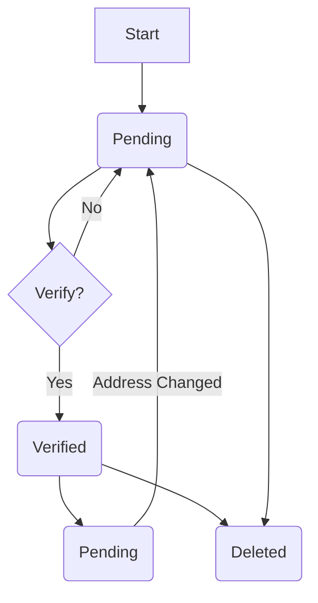

# Data Model: fix-property-schema-mismatch

## Updated Entities

### Property (Supabase Table: `properties`)

Alignment with `PropertyModel`.

| Field | Type | Default | Description |
|-------|------|---------|-------------|
| id | UUID | gen_random_uuid() | Primary Key |
| owner_id | UUID | - | Foreign Key to users.id |
| name | TEXT | - | Property display name |
| address | TEXT | - | Physical address |
| lat | DOUBLE | - | Latitude |
| lng | DOUBLE | - | Longitude |
| gender_orientation | gender_orientation | 'mixed' | Enum (existing) |
| amenities | TEXT[] | '{}' | List of string amenities |
| price_range | JSONB | - | Min/Max prices |
| status | property_status | 'pending' | **NEW ENUM** (pending, verified, deleted) |
| images | TEXT[] | '{}' | **NEW COLUMN** list of image URLs |
| description | TEXT | NULL | Markdown description |
| last_updated | TIMESTAMPTZ | NOW() | Update tracker |

### Property Status (Supabase Enum: `property_status`)

| Value | Description |
|-------|-------------|
| pending | Newly created or edited address, awaiting verification |
| verified | Approved by admin, visible to students |
| deleted | Hidden from public view (Soft Delete) |

## State Transitions

## Validation Rules

1. **Images**: MUST be a list of valid URLs (Supabase Storage).
2. **Soft Delete**: When `status` is set to `deleted`, Row Level Security (RLS) MUST prevent this row from appearing in queries for non-owners/non-admins.
3. **Address Change**: Updating the `address` field MUST reset the `status` to `pending`.
