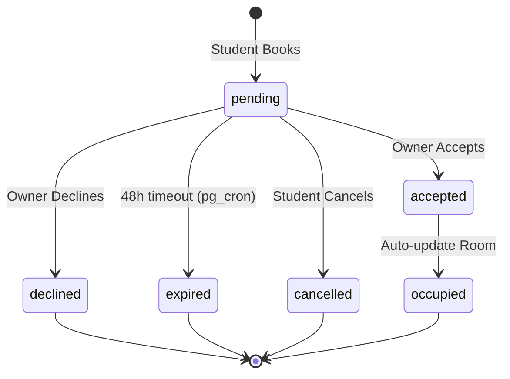

# Data Model: Room Booking System

## Entities

### Booking
Represents a student's request for a specific room.
- `id` (UUID, PK): Unique identifier.
- `student_id` (UUID, FK): References `profiles.id`.
- `room_id` (UUID, FK): References `rooms.id`.
- `property_id` (UUID, FK): References `properties.id`.
- `status` (Enum): `pending`, `accepted`, `declined`, `expired`, `cancelled`.
- `requested_at` (TIMESTAMPTZ): When the student submitted the request.
- `responded_at` (TIMESTAMPTZ, Nullable): When the owner accepted/declined.
- `expires_at` (TIMESTAMPTZ): `requested_at` + 48 hours.
- `owner_notes` (TEXT, Nullable): Optional message from owner on decline/accept.

### Notification
System-generated alerts for users.
- `id` (UUID, PK): Unique identifier.
- `user_id` (UUID, FK): References `profiles.id`.
- `title` (TEXT): Brief summary.
- `message` (TEXT): Detailed content.
- `type` (TEXT): `booking_request`, `booking_accepted`, `booking_declined`, `booking_expired`.
- `is_read` (BOOLEAN): Read status.
- `created_at` (TIMESTAMPTZ): When generated.

## State Transitions (Booking Status)

## Database Logic (PostgreSQL)

### Triggers
1. **On Booking Acceptance**: When `bookings.status` changes to `accepted`:
   - Update `rooms.status` to `occupied` for the associated `room_id`.
   - Update all other `pending` bookings for the same `room_id` to `declined` with reason "Room already taken".
   - Create a notification for the student.

2. **On Booking Request**: When a new booking is inserted:
   - Create a notification for the property owner.

### Scheduled Jobs (pg_cron)
- **Hourly Cleanup**: `UPDATE bookings SET status = 'expired' WHERE status = 'pending' AND expires_at < NOW()`.
